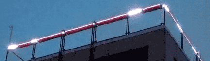
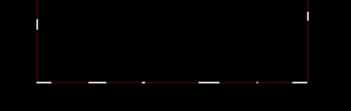

# spifake-lights

A replacement spi package that forwards messages via websockets for APA102-C lights. Cobbled together from a bunch of other example go.

The canvas drawing in web/ is very particular to the alignment of the lights I'm using, you should adjust to how your lights are arranged.

If you're using this spi package https://github.com/rakyll/experimental/tree/master/spi and you want to test your code with something javascript-based, use this drop in replacement to forward spi traffic over websockets

`import spi "github.com/nickoneill/spifake"`

 

